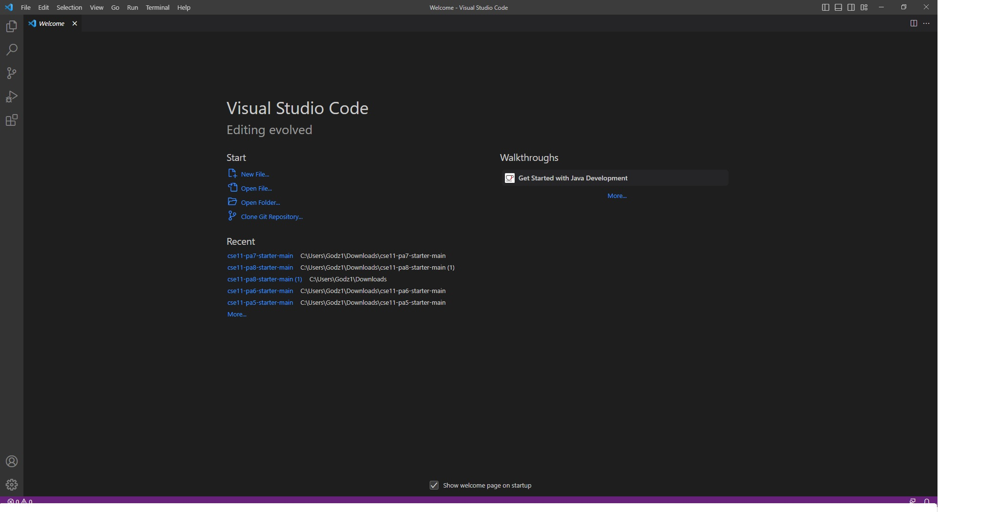
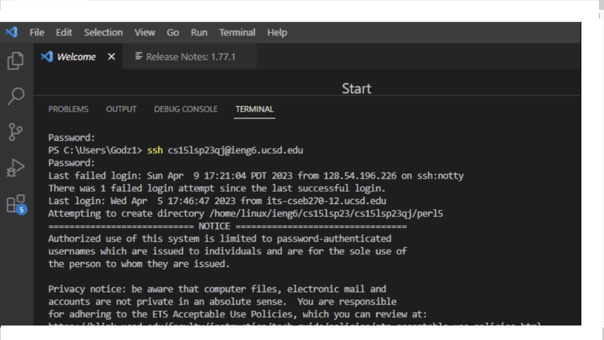
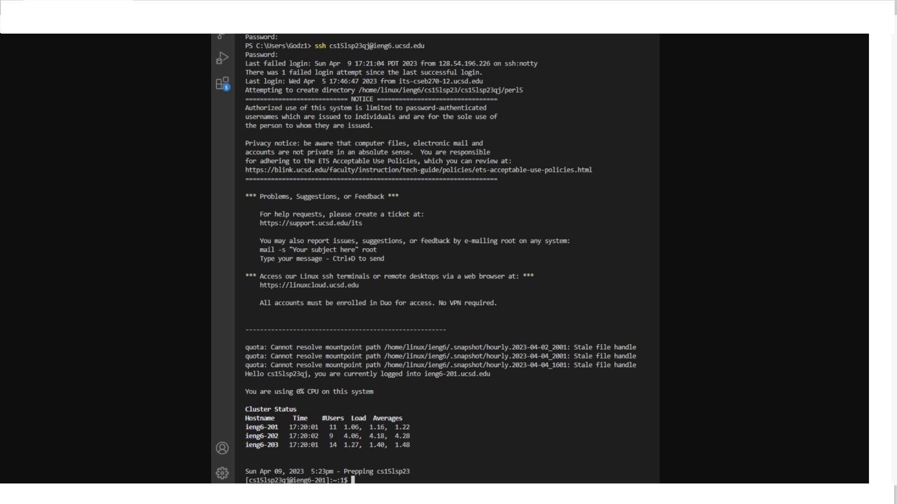

__ieng6__ __tutorial__ __login__:
> First, search and download VScode to your system and open the program once installed. 

> Then, at the top of the page click **terminal** and open a new terminal.
> Next, enter the command **ssh cs15lsp23xx@ieng6.ucsd.edu**, but replace "xx" with the two letters that are customly made for your account. 

> Make sure to enter your password, and answer "yes" to any extra prompted questions. 
> Once your password is entered, you may even see any previous attempted password attempts in the current session that show if you entered your password incorrectly. 
> This is the expected output of a **correct** password:

> After connecting, you can now type in certain commands to show that you are indeed connected to the correct server. 
> This the result of the command "cat /home/linux/ieng6/cs15lsp23/public/hello.txt" 
 
>It has returned the words inside the file hello.txt, which is a path in **ieng6**, confirming you're connected and have access to the server. 

                       
